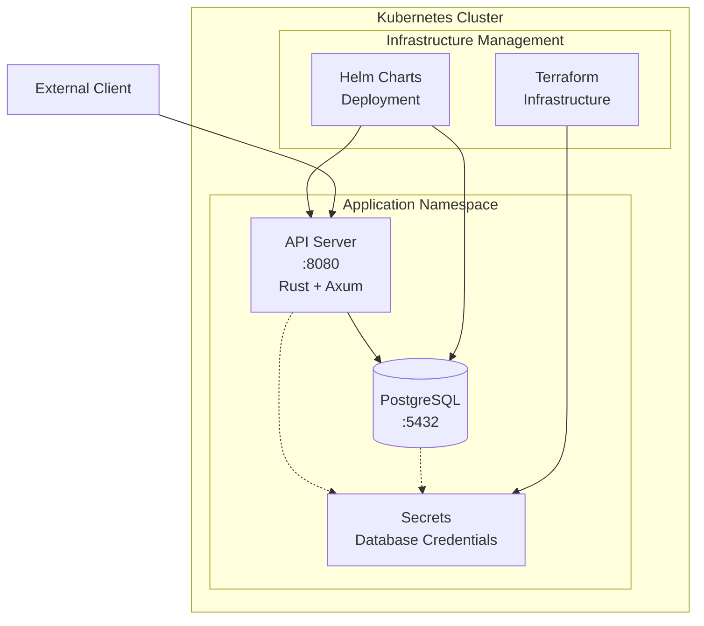

# 인프라 구축 완료 보고서

## 개요

본 보고서는 Rust 기반 API 서버와 PostgreSQL 데이터베이스를 Kubernetes 환경에서 구축한 내용을 담고 있습니다. 전체 인프라는 Terraform과 Helm을 활용하여 구현되었으며, Infrastructure as Code 원칙을 준수하였습니다.

## 인프라 아키텍처



1. 핵심 구성요소

### Kubernetes 환경 (Minikube)

- 개발 및 테스트용 단일 노드 클러스터 구성
- application 네임스페이스로 서비스 격리

### API 서버

- 개발 언어: Rust (Axum 프레임워크)
- 주요 기능: 상태 점검, DB CRUD 작업
- 포트: 8080

### 데이터베이스

- PostgreSQL 17.2 사용
- 데이터 영구 저장을 위한 PVC 구성
- 포트: 5432

### 2. 기술 스택

- 컨테이너 오케스트레이션: Kubernetes (Minikube)
- 인프라 프로비저닝: Terraform
- 애플리케이션 배포: Helm
- 데이터베이스: PostgreSQL
- API 서버: Rust (Axum 프레임워크)

### 3. 배포 프로세스

```bash
# 1. Minikube 클러스터 시작
minikube start --driver=docker

# 2. Terraform을 통한 인프라 구성
terraform init
terraform apply

# 3. PostgreSQL 데이터베이스 배포
helm install postgresql bitnami/postgresql \
  --namespace application \
  --set auth.password="postgres" \
  --set auth.database="stclab"

# 4. API 서버 배포
helm install api-service ./api-service --namespace application
```

### 4. 보안 구성

- DB 접속 정보는 Kubernetes Secret으로 관리
- 네임스페이스 분리로 서비스 격리
- 컨테이너 리소스 제한 설정

## 구축 결과 확인

### 1. 리소스 상태

```bash
➜  kubectl get all -n application                                                                                                                                                                           [16:03:33]
NAME                              READY   STATUS    RESTARTS   AGE
pod/api-service-966c546bc-k2cmr   1/1     Running   0          12s
pod/postgresql-0                  1/1     Running   0          21s

NAME                    TYPE        CLUSTER-IP       EXTERNAL-IP   PORT(S)    AGE
service/api-service     ClusterIP   10.100.201.120   <none>        8080/TCP   173m
service/postgresql      ClusterIP   10.104.201.69    <none>        5432/TCP   21s
service/postgresql-hl   ClusterIP   None             <none>        5432/TCP   21s

NAME                          READY   UP-TO-DATE   AVAILABLE   AGE
deployment.apps/api-service   1/1     1            1           12s

NAME                                    DESIRED   CURRENT   READY   AGE
replicaset.apps/api-service-966c546bc   1         1         1       12s

NAME                          READY   AGE
statefulset.apps/postgresql   1/1     21s
```

[]("~/Pictures/Screenshots/리소스_상태.png")

### 2. 헬스 체크 확인

```bash
➜  curl http://localhost:8080/
{"status":"healthy","timestamp":"2024-12-10T07:08:23.626882784+00:00"}
```

[]("~/Pictures/Screenshots/헬스체크.png/")

### 3. 데이터베이스 연결 확인

```bash

➜  kubectl exec -it postgresql-0 -n application -- psql -U postgres                                                                                                                                         [16:03:45]
Password for user postgres:
psql (17.2)
Type "help" for help.

postgres=# \d
Did not find any relations.
postgres=# \l
                                                     List of databases
   Name    |  Owner   | Encoding | Locale Provider |   Collate   |    Ctype    | Locale | ICU Rules |   Access privileges
-----------+----------+----------+-----------------+-------------+-------------+--------+-----------+-----------------------
 postgres  | postgres | UTF8     | libc            | en_US.UTF-8 | en_US.UTF-8 |        |           |
 stclab    | postgres | UTF8     | libc            | en_US.UTF-8 | en_US.UTF-8 |        |           |
 template0 | postgres | UTF8     | libc            | en_US.UTF-8 | en_US.UTF-8 |        |           | =c/postgres          +
           |          |          |                 |             |             |        |           | postgres=CTc/postgres
 template1 | postgres | UTF8     | libc            | en_US.UTF-8 | en_US.UTF-8 |        |           | =c/postgres          +
           |          |          |                 |             |             |        |           | postgres=CTc/postgres
(4 rows)

postgres=# \q

```

[]("~/Pictures/Screenshots/db_connection.png")

## 구축 완료 체크리스트

✅ Kubernetes 클러스터 정상 동작

✅ PostgreSQL 데이터베이스 배포 및 접근 가능

✅ API 서버 동작 및 헬스 체크 정상

✅ CRUD 작업 구현 완료

✅ Infrastructure as Code 구현

✅ Helm 차트 배포 구성

✅ 보안 설정 완료

## 향후 개선 사항

1. 모니터링 환경 구축

- Prometheus + Grafana 도입 및 로그 수집 시스템 구축

2. 운영 안정성 강화

- 백업/복구 정책 수립
- CI/CD 파이프라인 구축

## 결론

요구사항에 맞춰 API 서버와 DB를 Kubernetes 환경에서 성공적으로 구축했습니다. 코드 기반 인프라 관리로 유지보수가 용이하며, 향후 확장성을 고려한 구조로 설계했습니다.
